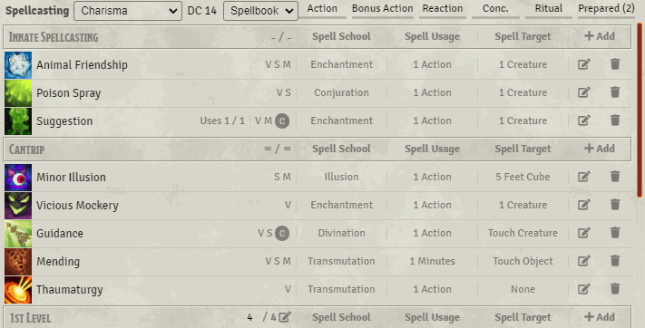
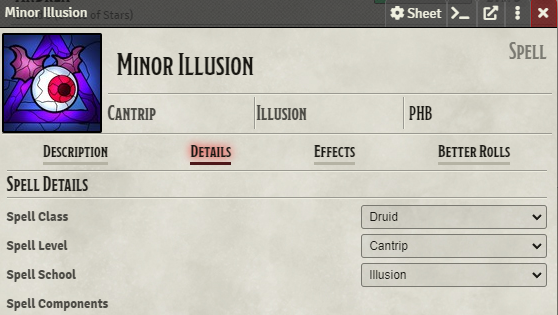

# Multiclass Spellbook filter for 5e

### If you want to buy me a coffee 

This module adds options for players to organize their spellbook by which class the spell is for.  Useful for multiclass characters or characters with the magic initiate feat.

To get the filter to work, you will need to populate the data in each spell.

## Installation

It's always easiest to install modules from the in game add-on browser.

To install this module manually:
1.  Inside the Foundry "Configuration and Setup" screen, click "Add-on Modules"
2.  Click "Install Module"
3.  In the "Manifest URL" field, paste the following url:
`https://raw.githubusercontent.com/p4535992/foundryvtt-spell-class-filter-dnd5e/master/src/module.json`
4.  Click 'Install' and wait for installation to complete
5.  Don't forget to enable the module in game using the "Manage Module" button

## Additional documentation

This module is specific to the dnd5e system and is not designed to work with other systems.

### Configuring this module
All settings for this module are found in Foundry's settings menu under the module settings tab.

Currently all of the settings that are available are client-side settings.  This means that what you change here will not have an effect on any other computer or player.

### Using the filter
This module relies on populating data that doesn't seem to exist by default: "Is this spell a {class} spell for you?"  So the first step is going to be going through each spell on your sheet and selecting the spell's class in the itemsheet's details tab.

  
<strong>Note:</strong> Your selection does not change which ability modifier your spell uses. That is configured elsewhere in the sheet.

Afterwards, if the proper setting is enabled, you will see a dropdown menu at the top of the spellbook with the rest of the filters.  Selecting an one of the classes will hide all of the spells that don't match your selection.

### Icon Replacement
Some players find it helpful to differentiate spells by class even when the list is not filtered.  To help with that this module provides the option to 'cover' the spell's icon in the spellbook with the icon of their source class.

To enable this behavior enable it in the module's settings. This setting is disabled by default.

  
<strong>Note:</strong> This feature does not change any data or other behaviors.  The spell's icon will still be what is displayed in chat and in other sections of the sheet.
  

## [Changelog](./CHANGELOG.md)

## Issues

Any issues, bugs, or feature requests are always welcome to be reported directly to the [Issue Tracker](https://github.com/p4535992/foundryvtt-spell-class-filter-dnd5e/issues ), or using the [Bug Reporter Module](https://foundryvtt.com/packages/bug-reporter/).

## License

This package is under an [MIT license](LICENSE) and the [Foundry Virtual Tabletop Limited License Agreement for module development](https://foundryvtt.com/article/license/).
